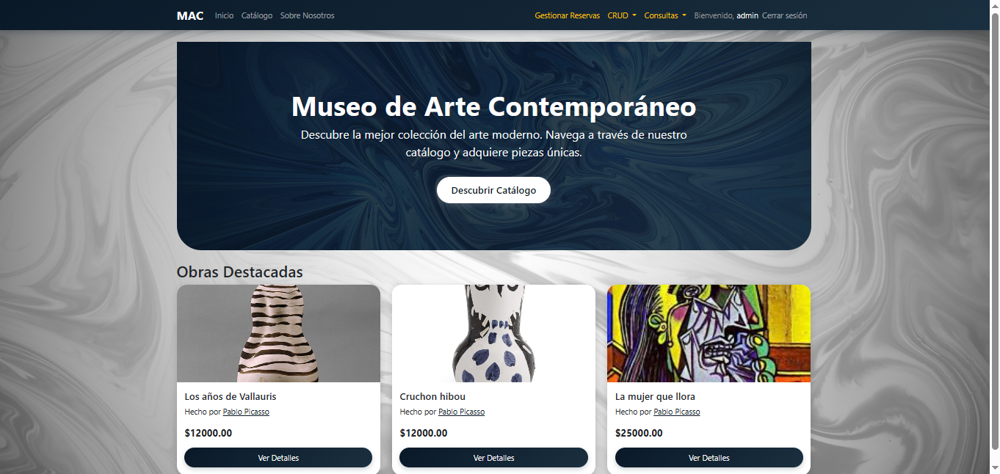
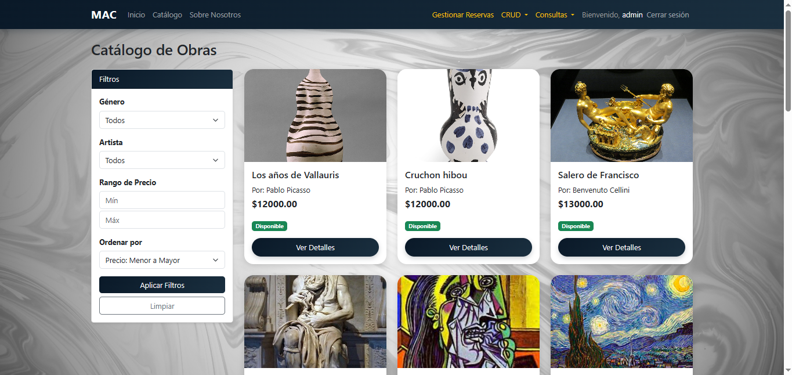
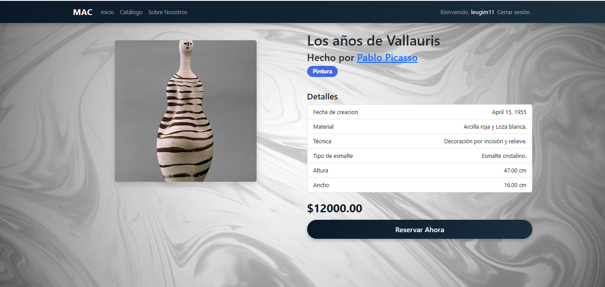

# 🎨 Contemporary Art Museum System

A web-based system for managing the exhibition and sale of artworks in a contemporary art museum.

This project was built using **Django + MySQL**, focusing on database modeling, business logic, and role-based workflows for buyers and employees.

---

## 🚀 Features

### 🖼️ Artwork Management
- Artworks categorized by genre
- Specialized attributes using **multi-table inheritance**
  - Painting, Sculpture, Photography, Ceramic, Goldsmithing
- Artwork status workflow:
  - `AVAILABLE → RESERVED → SOLD`

### 👤 User Roles
- **Visitors**
  - Browse featured artworks
  - Search catalog (artist, genre, price)
  - Register as buyers

- **Buyers**
  - Log in
  - Reserve artworks using a security code
  - Membership system ($10)

- **Employees (Admin)**
  - Full CRUD via Django Admin
  - Finalize sales (generate invoices)
  - View reports (sales, memberships)

---

## 🧠 Business Process

1. Buyer registers and pays membership  
2. Buyer reserves an artwork  
3. Employee contacts the buyer  
4. Employee creates a sale (invoice)  
5. Artwork status updates to `SOLD`  

---

## 🛠️ Tech Stack

- **Backend**: Python, Django 6  
- **Database**: MySQL  
- **Frontend**: HTML5, Bootstrap 5  
- **ORM**: Django ORM  

---

## 🧩 Database Design Highlights

- **Multi-table inheritance** for artwork specialization
- **One-to-One**: User ↔ BuyerProfile  
- **Many-to-Many**: Artist ↔ Genre  
- **One-to-Many**: Artist → Artwork  
- **One-to-One**: Artwork → Sale  

For full database documentation, see:  
👉 `DOCUMENTATION.md`

---

## ⚙️ Setup Instructions

```bash
# Clone repository
git clone https://github.com/your-username/museo-arte.git
cd museo-arte

# Create virtual environment
python -m venv venv
source venv/bin/activate  # (Linux/Mac)
# venv\Scripts\activate   # (Windows)

# Install dependencies
pip install -r requirements.txt

# Run migrations
python manage.py migrate

# Start server
python manage.py runserver
```

---

## 📸 Screenshots

> (Add your screenshots in the /screenshots folder)

### Home Page


### Catalog


### Artwork Detail



---

## 📌 Notes

- The system uses **Django Admin** as the employee interface
- Credit card data is for demonstration purposes only
- Database structure is managed through Django migrations

---

## 📄 Documentation

Detailed technical documentation available in:

- `DOCUMENTATION.md` → Full database & model explanation

---

## 👨‍💻 Author

Developed by **Miguel**  
