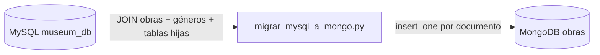

# Sprint 1 — Catálogo dinámico (MongoDB)

Documentación del trabajo realizado en el marco del **Proyecto Académico: Plataforma Políglota para el Museo de Arte Contemporáneo**.

---

## 1. Contexto del proyecto completo

| Capa | Tecnología | Rol |
|------|------------|-----|
| **Core transaccional (SBD I)** | Django + MySQL | Usuarios, reservas, ventas, facturación, membresías — datos ACID |
| **Sprint 1 — Catálogo** | MongoDB | Obras y metadatos flexibles por género |
| Sprints futuros | Neo4j, Cassandra, APIs/microservicios | Recomendaciones, auditorías, integración |

El museo **no partió de cero**: se reutiliza el sistema relacional existente y se **añade** una capa documental para el catálogo, simulando modernización con coexistencia de datos.

---

## 2. Objetivo del Sprint 1

> Diseñar un catálogo con **esquemas flexibles** y **polimorfismo estructural**, migrar artistas y obras desde MySQL, y entregar esquema BSON, scripts de inserción y consultas con el **Aggregation Framework** (precio, género, disponibilidad).

**Duración prevista:** semanas 1–2.

---

## 3. ¿Se logró el sprint?

### Resumen ejecutivo

| Entregable del enunciado | Estado | Evidencia en el repo |
|--------------------------|--------|----------------------|
| Esquema de colecciones BSON (embebido vs referencia) | **Sí** | Modelo en `migrar_mysql_a_mongo.py` + sección 4 de este documento |
| Migración de artistas y obras | **Sí** | `migrar_mysql_a_mongo.py` (ETL MySQL → MongoDB) |
| Scripts de inserción | **Sí** | Mismo script de migración (`insert_one` por obra) |
| Consultas Aggregation (precio, género, disponibilidad) | **Sí** | `consultas.py` (5 pipelines) |
| Integración del catálogo web con MongoDB | **No** | La app Django sigue leyendo MySQL (`museum/views.py`) |
| Microservicio / API REST del catálogo | **No** | Aún no hay servicio separado; scripts standalone |
| Índices MongoDB documentados/creados | **Parcial** | No hay script de índices explícito |
| Colección separada `artistas` | **No** | Artista embebido en cada obra (decisión de diseño justificable) |

**Conclusión:** el sprint cumple los entregables **de modelado, migración y consultas NoSQL** exigidos para la fase documental. Quedan pendientes la **integración operativa** (que el catálogo en producción lea MongoDB) y artefactos típicos de arquitectura de microservicios (API, índices formales), que encajan mejor en el sprint de integración final.

---

## 4. Qué había antes (core relacional)

El sistema base (`documentation.md`, `museum/models.py`) implementa:

- **Herencia multi-tabla** en Django: `Artwork` base + tablas hijas `Painting`, `Sculpture`, `Photography`, `Ceramic`, `Goldsmithing`.
- Cada género tiene atributos distintos en tablas SQL separadas (equivalente relacional al polimorfismo que MongoDB resuelve en un solo documento).
- Géneros en español: Pintura, Escultura, Fotografía, Cerámica, Orfebrería.
- Estados de obra: `AVAILABLE`, `RESERVED`, `SOLD`.
- Flujo de negocio: registro → membresía → reserva → venta (factura).

Ese diseño es el **origen de verdad transaccional** del que parte la migración.

---

## 5. Diseño documental en MongoDB

### 5.1 Base de datos y colección

| Elemento | Valor |
|----------|--------|
| Cliente | `db_mongo.py` — PyMongo + variables `MONGO_URI`, `MONGO_CA_FILE` |
| Base de datos | `defaultdb` (configurable) |
| Colección principal | `obras` |

### 5.2 Esquema BSON de un documento en `obras`

```json
{
  "title": "Guernica",
  "artist": {
    "_id": 1,
    "name": "Pablo Picasso",
    "nationality": "Española",
    "biography": "..."
  },
  "genre": "Pintura",
  "price": 15000000.0,
  "creation_date": "1937-01-01",
  "photo": "artworks/guernica.jpg",
  "status": "AVAILABLE",
  "detalles_especificos": {
    "technique": "oil",
    "support": "canvas",
    "height": 349.0,
    "width": 776.0
  }
}
```

Los campos dentro de `detalles_especificos` **cambian según el género** (polimorfismo estructural).

### 5.3 Embebido vs referencia — justificación

| Decisión | Opción elegida | Por qué |
|----------|----------------|---------|
| Datos del artista en el catálogo | **Embebido** (`artist: { ... }`) | Lectura del catálogo en una sola consulta; el artista se muestra siempre con la obra; volumen bajo de duplicación en un museo académico |
| Atributos por género | **Subdocumento** `detalles_especificos` | Evita colecciones por tipo (pinturas, esculturas…) y replica el polimorfismo del modelo Django sin JOINs |
| ID relacional | Conservado en `artist._id` | Permite trazabilidad con MySQL si más adelante se sincronizan ventas/reservas |
| Colección `artistas` separada | **No implementada** | Válido si hubiera muchas obras por artista y biografías enormes; aquí priorizan simplicidad de consulta |

Alternativa no usada: colección `artistas` + `artist_id` en `obras` (normalización documental), útil si los artistas se actualizan con frecuencia y hay que propagar cambios a miles de documentos.

---

## 6. Cómo se migró (coexistencia MySQL → MongoDB)

**Archivo:** `migrar_mysql_a_mongo.py`

### Flujo



1. Conecta a **MySQL** (credenciales en `.env`: `MYSQL_*`, SSL con `ca-mysql.pem`).
2. Carga todos los artistas en memoria (`id → documento`).
3. Ejecuta un **JOIN amplio** sobre `museum_artwork`, `museum_genre` y las tablas `museum_painting`, `museum_sculpture`, etc. (una fila por obra con columnas de todos los tipos; solo las del género correspondiente tienen valor).
4. Por cada fila:
   - Convierte `Decimal` → `float` (compatibilidad BSON).
   - Arma el documento con artista embebido.
   - Rellena `detalles_especificos` según `genre_name` (comparación en minúsculas: pintura, escultura, fotografía, cerámica, orfebrería).
5. `obras_col.insert_one(doc)`.
6. Imprime el total insertado.

**Datos de prueba en MySQL:** `seed_data.py` crea géneros, Picasso, Dalí y obras de ejemplo antes de migrar.

---

## 7. Consultas con Aggregation Framework

**Archivo:** `consultas.py`

| # | Objetivo | Etapas principales |
|---|----------|-------------------|
| 1 | Pintura + disponible + rango de precio | `$match` (genre, status, price) → `$project` |
| 2 | Escultura disponible con peso > 50 kg | `$match` en `detalles_especificos.weight` |
| 3 | Todas las disponibles (título y precio) | `$match` status → `$project` |
| 4 | Estadísticas por género | `$group` (count, avg price) → `$sort` |
| 5 | Obras de un artista | `$match` en `artist.name` |

Estas consultas cubren explícitamente los filtros del enunciado: **precio**, **género** y **disponibilidad** (`status: "AVAILABLE"`).

### Ejecución

```bash
# Requisitos: pymongo, mysql-connector-python, python-dotenv
python migrar_mysql_a_mongo.py   # una vez, o tras limpiar la colección
python consultas.py
```

---

## 8. Archivos del sprint y su función

| Archivo | Función |
|---------|---------|
| `db_mongo.py` | Conexión a MongoDB Atlas; expone `obras_col` |
| `migrar_mysql_a_mongo.py` | ETL: inserción masiva del catálogo documental |
| `consultas.py` | Entregable de agregaciones |
| `seed_data.py` | Población inicial del core MySQL (Django) |
| `documentation.md` / `README.md` | Documentación del core relacional (Sprint 0 / SBD I) |
| `museum/models.py` | Modelo polimórfico relacional fuente |
| `write_catalog.py` | Utilidad aparte para regenerar plantilla HTML del catálogo Django (no es parte del pipeline Mongo) |

---

## 9. Relación con roles del equipo (Sprint 1)

| Rol académico | Trabajo observable en el repo |
|---------------|-------------------------------|
| DBA Documental (MongoDB) | Esquema `obras`, migración, agregaciones |
| DBA Relacional | Modelo Django/MySQL, migraciones, `seed_data.py` |
| Arquitecto de integración | Pendiente: API que unifique catálogo Mongo + transacciones MySQL |

---

## 10. Limitaciones y trabajo recomendado (siguientes pasos)

1. **Catálogo web:** `museum/views.py` filtra con el ORM sobre MySQL; para cerrar el sprint “de punta a punta”, el listado público debería consumir MongoDB (o un microservicio de catálogo).
2. **Idempotencia de migración:** ejecutar el script varias veces duplica documentos; conviene `delete_many({})`, upsert por `id` relacional, o índice único.
3. **Índices:** por ejemplo `{ genre: 1, status: 1, price: 1 }` y `{ "artist.name": 1 }` para las consultas del sprint.
4. **Seguridad:** no versionar credenciales en `.env`; usar secretos locales o CI.
5. **Sincronización:** definir si MySQL o MongoDB es master del catálogo tras altas/ediciones en Django Admin.

---

## 11. Respuesta directa: “¿Se logró el sprint? ¿Cómo?”

**Sí, en lo esencial del Sprint 1 (paradigma documental):**

1. Se **justificó y modeló** una colección BSON con artista embebido y detalles polimórficos por género.
2. Se **migraron** artistas y obras desde el modelo relacional existente hacia MongoDB con un script ETL real (`migrar_mysql_a_mongo.py`).
3. Se entregaron **consultas de agregación** que filtran por precio, género y disponibilidad, más consultas adicionales (peso en esculturas, estadísticas por género, filtro por artista).

**Cómo:** reutilizando el “core” Django/MySQL como fuente, leyendo el polimorfismo de las tablas hijas en un solo JOIN SQL y transformándolo al subdocumento `detalles_especificos`, que es el equivalente documental a la herencia multi-tabla del ORM.

Lo que **aún no** es sprint 1 estricto de “plataforma integrada”, pero sí del proyecto global: microservicio de catálogo, lectura Mongo desde la UI, e índices — previstos para integración o sprints posteriores.

---

## 12. Referencias rápidas en código

Conexión MongoDB:

```17:18:c:\Users\amvmi\Documents\GitHub\museo-arte\db_mongo.py
db = cliente["defaultdb"]   # cámbialo por "catalogo_arte" si es otro
obras_col = db["obras"]
```

Construcción del documento y polimorfismo:

```69:128:c:\Users\amvmi\Documents\GitHub\museo-arte\migrar_mysql_a_mongo.py
    doc = {
        "title": obra["title"],
        "artist": {
            "_id": artista.get("id"),
            "name": artista.get("name"),
            ...
        },
        "genre": obra["genre_name"],
        ...
        "detalles_especificos": {}
    }
    genre = obra["genre_name"].lower()
    if genre == "pintura":
        doc["detalles_especificos"] = { ... }
    ...
    obras_col.insert_one(doc)
```

Consulta requerida (precio + género + disponibilidad):

```7:24:c:\Users\amvmi\Documents\GitHub\museo-arte\consultas.py
resultado = obras_col.aggregate([
    {
        "$match": {
            "genre": "Pintura",
            "status": "AVAILABLE",
            "price": { "$gte": 1000, "$lte": 5000000 }
        }
    },
    ...
])
```
