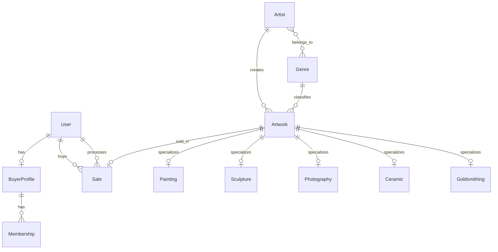

# 🗄️ Contemporary Art Museum

## Problem Statement
The system manages the exhibition and sale of artworks for the Museum of Contemporary Art. It handles:
- **Artworks**: Categorized by genre with specific attributes modeled via multi-table inheritance (Painting, Sculpture, Photography, Ceramic, Goldsmithing).
- **Artists**: Information including biography and genres.
- **Users**:
  - **Buyers**: Register, pay membership ($10), receive a security code, reserve artworks.
  - **Employees (Admins)**: Manage CRUD, finalize sales, generate invoices, and view reports.
- **Process**: Buyer reserves → Employee contacts → Employee creates Sale (Invoice) → Status becomes 'SOLD'.

---

## Overview

The project uses **Django ORM** to define models. Django automatically translates Python classes into MySQL tables through migrations. The database is named `museum_db`.

The design uses **multi-table inheritance** in Django to model specialization of artworks by genre. Each artwork type (Painting, Sculpture, Photography, Ceramic, Goldsmithing) inherits from a base `Artwork` model, creating separate tables with specific attributes.

**Additions / Assumptions**:
- Added `BuyerProfile` to separate buyer-specific data (credit card, shipping).
- Added `Membership` model to track payment history.
- Used Django Admin as the employee interface for CRUD operations and reports.

---

## Use Cases

### Visitor
- View Home Page (featured artworks)
- Search Catalog (filter by Artist, Genre, Price)
- Register (become a buyer)

### Buyer
- Log in
- Reserve artwork (enter security code)

### Admin (Employee)
- CRUD Artists, Genres, Artworks
- Finalize sale (create invoice)
- View sales report
- View membership report

---

## Tools Used

- **Language**: Python 3.x  
- **Framework**: Django 6.0.2  
- **DBMS**: MySQL  
- **Frontend**: HTML5, Bootstrap 5  

---

## Entities (Database-Oriented View)

### User

- id_user (PK)
- username
- password
- email
- is_buyer
- is_employee
- date_joined

---

### BuyerProfile

- id_buyer_profile (PK)
- user_id (FK → User)
- credit_card_number
- security_code
- shipping_address

---

### Genre

- id_genre (PK)
- name

Registered genres: Painting, Sculpture, Photography, Ceramic, Goldsmithing.

---

### Artist

- id_artist (PK)
- name
- biography
- birth_date
- nationality
- photo

---

### Artwork (Base Model)

- id_artwork (PK)
- title
- artist_id (FK → Artist)
- genre_id (FK → Genre)
- price
- creation_date
- photo
- status

---

### Painting (inherits from Artwork)

- artwork_ptr_id (PK, FK → Artwork)
- technique (oil, acrylic, watercolor)
- support (canvas, wood, paper)
- height
- width

---

### Sculpture (inherits from Artwork)

- artwork_ptr_id (PK, FK → Artwork)
- material
- weight
- height
- width
- depth

---

### Photography (inherits from Artwork)

- artwork_ptr_id (PK, FK → Artwork)
- photo_type (digital, analog)
- camera
- technique (black & white, color)
- height
- width

---

### Ceramic (inherits from Artwork)

- artwork_ptr_id (PK, FK → Artwork)
- material
- technique
- glaze_type
- height
- width

---

### Goldsmithing (inherits from Artwork)

- artwork_ptr_id (PK, FK → Artwork)
- material (gold, silver, bronze, copper)
- object_type (ring, necklace, bracelet)
- weight
- gemstones

---

### Membership

- id_membership (PK)
- buyer_profile_id (FK → BuyerProfile)
- start_date
- amount

---

### Sale

- id_sale (PK)
- artwork_id (FK UNIQUE → Artwork)
- buyer_id (FK → User)
- processed_by (FK → User)
- date
- subtotal
- iva
- commission
- total

---

## ER Relationships

- User 1 —— 1 BuyerProfile  
- BuyerProfile 1 —— N Membership  
- Artist N —— M Genre  
- Artist 1 —— N Artwork  
- Genre 1 —— N Artwork  
- Painting 1 —— 1 Artwork (multi-table inheritance)  
- Sculpture 1 —— 1 Artwork (multi-table inheritance)  
- Photography 1 —— 1 Artwork (multi-table inheritance)  
- Ceramic 1 —— 1 Artwork (multi-table inheritance)  
- Goldsmithing 1 —— 1 Artwork (multi-table inheritance)  
- Artwork 1 —— 1 Sale  
- User 1 —— N Sale (as buyer)  
- User 1 —— N Sale (as employee)

---

## ER Diagram



---

## App `users` — File: `users/models.py`

### User Model (extends Django `AbstractUser`)

Includes all default Django fields plus:

| Field | Django Type | MySQL Type | Description |
|------|------------|------------|-------------|
| is_buyer | BooleanField | TINYINT(1) | Is a buyer |
| is_employee | BooleanField | TINYINT(1) | Is an employee |

**Why AbstractUser?**  
Allows using Django’s authentication system without rebuilding it.

**Required setting in `settings.py`:**
```python
AUTH_USER_MODEL = 'users.User'
```

---

### BuyerProfile Model

| Field | Django Type | MySQL Type | Description |
|------|------------|------------|-------------|
| user | OneToOneField | INT FK UNIQUE | 1:1 with User |
| credit_card_number | CharField | VARCHAR(19) | Credit card (demo) |
| security_code | CharField | VARCHAR(10) | Security code |
| shipping_address | TextField | TEXT | Shipping address |

---

## App `museum` — File: `museum/models.py`

### Genre Model

| Field | Django Type | MySQL Type |
|------|------------|------------|
| id | AutoField | INT |
| name | CharField | VARCHAR(100) |

---

### Artist Model

| Field | Django Type | MySQL Type |
|------|------------|------------|
| id | AutoField | INT |
| name | CharField | VARCHAR(200) |
| biography | TextField | TEXT |
| birth_date | DateField | DATE |
| nationality | CharField | VARCHAR(100) |
| photo | ImageField | VARCHAR |
| genres | ManyToManyField | Intermediate table |

---

### Artwork Model

Includes:
- title
- artist (FK)
- genre (FK)
- price
- creation_date
- photo
- status

**State machine:**
```
AVAILABLE → RESERVED → SOLD
```

---

### Specialized Tables

Each subclass creates its own table linked via `OneToOneField`.

---

### Membership Model

- Tracks payments
- One buyer → multiple memberships

---

### Sale Model

- One artwork → one sale
- Includes tax (IVA) and commission calculations

```python
subtotal = artwork.price
iva = subtotal * 0.16
commission = subtotal * 0.10
total = subtotal + iva
```

---

## How to Make Changes

### Add a Field
```bash
python manage.py makemigrations
python manage.py migrate
```

### Create a Model
1. Add class in `models.py`
2. Register in `admin.py`
3. Run migrations

### Modify a Field
- Edit model
- Run migrations

### Delete Field/Model
- Remove from code
- Run migrations

> ⚠️ Never modify MySQL directly. Always use Django migrations.

---

## Generated MySQL Tables

| Table | Model | App |
|------|------|-----|
| users_user | User | users |
| users_buyerprofile | BuyerProfile | users |
| museum_genre | Genre | museum |
| museum_artist | Artist | museum |
| museum_artist_genres | M2M | museum |
| museum_artwork | Artwork | museum |
| museum_painting | Painting | museum |
| museum_sculpture | Sculpture | museum |
| museum_photography | Photography | museum |
| museum_ceramic | Ceramic | museum |
| museum_goldsmithing | Goldsmithing | museum |
| museum_membership | Membership | museum |
| museum_sale | Sale | museum |

Django also creates internal tables like:
- auth_group
- auth_permission
- django_session
- django_content_type
- django_migrations
