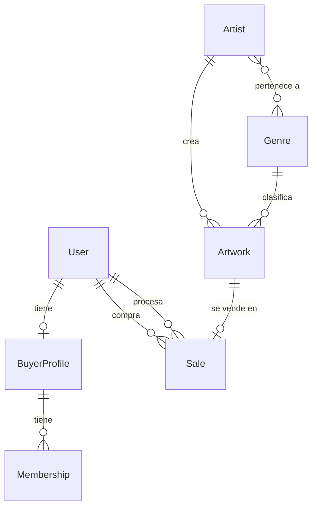

# 🗄️ Modelado de Base de Datos — Museo de Arte Contemporáneo

Este documento explica cómo se implementó el modelado de la base de datos usando Django ORM con MySQL.

---

## Visión General

El proyecto usa **Django ORM** para definir los modelos. Django traduce automáticamente las clases Python en tablas MySQL mediante migraciones. La base de datos se llama `museum_db`.

### Diagrama de Relaciones (ER)



---

## App `users` — Archivo: `users/models.py`

### Tabla `User` (extiende `AbstractUser` de Django)

Hereda todos los campos de Django (username, password, email, etc.) y agrega:

| Campo | Tipo Django | Tipo MySQL | Descripción |
|-------|------------|------------|-------------|
| `is_buyer` | `BooleanField(default=False)` | `TINYINT(1)` | ¿Es comprador? |
| `is_employee` | `BooleanField(default=False)` | `TINYINT(1)` | ¿Es empleado del museo? |

**¿Por qué `AbstractUser`?** Permite usar el sistema de autenticación de Django (login, logout, permisos) sin crear un sistema desde cero. Los flags `is_buyer` e `is_employee` diferencian los roles.

**Configuración requerida** en `settings.py`:
```python
AUTH_USER_MODEL = 'users.User'
```

### Tabla `BuyerProfile`

| Campo | Tipo Django | Tipo MySQL | Descripción |
|-------|------------|------------|-------------|
| `user` | `OneToOneField(User)` | `INT FK UNIQUE` | Relación 1:1 con User |
| `credit_card_number` | `CharField(max_length=19)` | `VARCHAR(19)` | Número de tarjeta (demo) |
| `security_code` | `CharField(max_length=10)` | `VARCHAR(10)` | Código de seguridad generado |
| `shipping_address` | `TextField` | `TEXT` | Dirección de envío |

**Relación:** `OneToOneField` → Un usuario tiene exactamente un perfil de comprador. Si se elimina el User, se elimina el perfil (`on_delete=CASCADE`).

**Acceso en código:**
```python
# Desde el usuario al perfil:
request.user.buyer_profile.credit_card_number

# Desde el perfil al usuario:
profile.user.username
```

---

## App `museum` — Archivo: `museum/models.py`

### Tabla `Genre`

| Campo | Tipo Django | Tipo MySQL | Descripción |
|-------|------------|------------|-------------|
| `id` | Auto (PK) | `INT AUTO_INCREMENT` | Clave primaria |
| `name` | `CharField(max_length=100)` | `VARCHAR(100)` | Nombre del género |

### Tabla `Artist`

| Campo | Tipo Django | Tipo MySQL | Descripción |
|-------|------------|------------|-------------|
| `id` | Auto (PK) | `INT AUTO_INCREMENT` | Clave primaria |
| `name` | `CharField(max_length=200)` | `VARCHAR(200)` | Nombre |
| `biography` | `TextField` | `TEXT` | Biografía |
| `birth_date` | `DateField(null=True)` | `DATE NULL` | Fecha de nacimiento |
| `nationality` | `CharField(max_length=100)` | `VARCHAR(100)` | Nacionalidad |
| `photo` | `ImageField(upload_to='artists/')` | `VARCHAR(100)` | Ruta de imagen |
| `genres` | `ManyToManyField(Genre)` | Tabla intermedia | Géneros del artista |

**Relación M:N (Artist ↔ Genre):**
Django crea automáticamente una tabla intermedia `museum_artist_genres` con dos FK:
```sql
-- Tabla generada automáticamente:
CREATE TABLE museum_artist_genres (
    id INT AUTO_INCREMENT PRIMARY KEY,
    artist_id INT REFERENCES museum_artist(id),
    genre_id INT REFERENCES museum_genre(id)
);
```

**Acceso en código:**
```python
# Géneros de un artista:
artist.genres.all()

# Artistas de un género (gracias a related_name='artists'):
genre.artists.all()
```

### Tabla `Artwork`

| Campo | Tipo Django | Tipo MySQL | Descripción |
|-------|------------|------------|-------------|
| `id` | Auto (PK) | `INT AUTO_INCREMENT` | Clave primaria |
| `title` | `CharField(max_length=200)` | `VARCHAR(200)` | Título de la obra |
| `artist` | `ForeignKey(Artist)` | `INT FK` | Artista creador |
| `genre` | `ForeignKey(Genre, null=True)` | `INT FK NULL` | Género de la obra |
| `price` | `DecimalField(10, 2)` | `DECIMAL(10,2)` | Precio en USD |
| `creation_date` | `DateField` | `DATE` | Fecha de creación |
| `photo` | `ImageField(upload_to='artworks/')` | `VARCHAR(100)` | Imagen de la obra |
| `status` | `CharField(choices=...)` | `VARCHAR(20)` | Estado actual |
| `attributes` | `JSONField(default=dict)` | `JSON` | Atributos flexibles |

**Campo `status` — Máquina de estados:**
```
AVAILABLE  →  RESERVED  →  SOLD
(Disponible)  (Reservada)  (Vendida)
```
- Un comprador puede reservar una obra → cambia a `RESERVED`
- Un empleado finaliza la venta desde el admin → cambia a `SOLD`

**Campo `attributes` (JSONField):**
Permite guardar atributos específicos por tipo de obra sin modificar la estructura de la tabla:
```python
# Escultura:
{"material": "bronce", "peso": "15kg", "dimensiones": "50x30x20cm"}

# Pintura:
{"técnica": "óleo sobre lienzo", "dimensiones": "100x80cm"}
```

**Relaciones FK:**
- `artist`: `on_delete=CASCADE` → Si se elimina el artista, se eliminan sus obras
- `genre`: `on_delete=SET_NULL` → Si se elimina el género, la obra queda sin género (no se borra)

### Tabla `Membership`

| Campo | Tipo Django | Tipo MySQL | Descripción |
|-------|------------|------------|-------------|
| `id` | Auto (PK) | `INT AUTO_INCREMENT` | Clave primaria |
| `buyer_profile` | `ForeignKey(BuyerProfile)` | `INT FK` | Perfil del comprador |
| `start_date` | `DateField(auto_now_add=True)` | `DATE` | Fecha de inicio (auto) |
| `amount` | `DecimalField(6, 2, default=10)` | `DECIMAL(6,2)` | Monto pagado |

**Relación:** Un comprador puede tener varias membresías (`1:N`).

### Tabla `Sale`

| Campo | Tipo Django | Tipo MySQL | Descripción |
|-------|------------|------------|-------------|
| `id` | Auto (PK) | `INT AUTO_INCREMENT` | Clave primaria |
| `artwork` | `OneToOneField(Artwork)` | `INT FK UNIQUE` | Obra vendida (1:1) |
| `buyer` | `ForeignKey(User)` | `INT FK` | Comprador |
| `date` | `DateTimeField(default=now)` | `DATETIME` | Fecha de venta |
| `subtotal` | `DecimalField(12, 2)` | `DECIMAL(12,2)` | Precio de la obra |
| `iva` | `DecimalField(12, 2)` | `DECIMAL(12,2)` | 16% IVA |
| `commission` | `DecimalField(12, 2)` | `DECIMAL(12,2)` | 10% comisión del museo |
| `total` | `DecimalField(12, 2)` | `DECIMAL(12,2)` | subtotal + IVA |
| `processed_by` | `ForeignKey(User, null=True)` | `INT FK NULL` | Empleado que procesó |

**Lógica de cálculo** (en `save()` y en `SaleAdmin`):
```python
subtotal = artwork.price
iva = subtotal * 0.16        # 16%
commission = subtotal * 0.10  # 10%
total = subtotal + iva
```

**Relación `OneToOneField` con Artwork:** Una obra solo puede venderse una vez.

---

## Cómo Hacer Cambios

### Agregar un campo a un modelo existente

1. Edita el archivo `models.py` correspondiente:
   ```python
   class Artwork(models.Model):
       # ... campos existentes ...
       description = models.TextField(blank=True, default='')  # NUEVO
   ```

2. Crea y aplica la migración:
   ```bash
   python manage.py makemigrations
   python manage.py migrate
   ```

### Crear un nuevo modelo

1. Agrega la clase en `models.py`:
   ```python
   class Exhibition(models.Model):
       name = models.CharField(max_length=200)
       start_date = models.DateField()
       artworks = models.ManyToManyField(Artwork)
   ```

2. Regístralo en `admin.py`:
   ```python
   from .models import Exhibition
   admin.site.register(Exhibition)
   ```

3. Crea y aplica migraciones:
   ```bash
   python manage.py makemigrations
   python manage.py migrate
   ```

### Modificar un campo existente

1. Cambia el campo en `models.py`
2. Ejecuta `makemigrations` → Django detecta el cambio automáticamente
3. Ejecuta `migrate` → Aplica el `ALTER TABLE` en MySQL

### Eliminar un campo o modelo

1. Elimina del código
2. `makemigrations` → genera migración con `RemoveField` o `DeleteModel`
3. `migrate` → aplica `DROP COLUMN` o `DROP TABLE`

> **⚠️ Importante:** Nunca modifiques las tablas directamente en MySQL. Siempre usa migraciones de Django para mantener la sincronización.

---

## Resumen de Tablas MySQL Generadas

| Tabla MySQL | Modelo Django | App |
|-------------|--------------|-----|
| `users_user` | `User` | users |
| `users_buyerprofile` | `BuyerProfile` | users |
| `museum_genre` | `Genre` | museum |
| `museum_artist` | `Artist` | museum |
| `museum_artist_genres` | *(tabla M:N automática)* | museum |
| `museum_artwork` | `Artwork` | museum |
| `museum_membership` | `Membership` | museum |
| `museum_sale` | `Sale` | museum |

Django también genera tablas internas: `auth_group`, `auth_permission`, `django_session`, `django_content_type`, `django_migrations`, etc.
