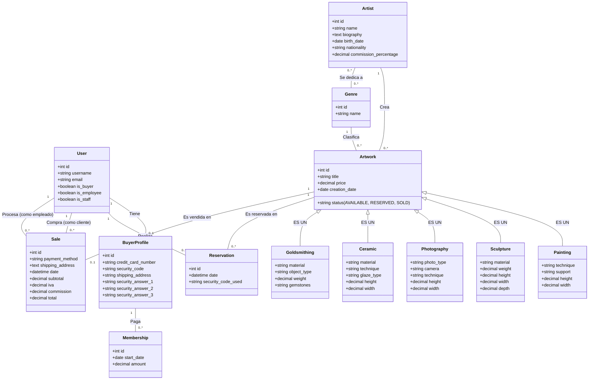

# Documentación del Proyecto: Museo de Arte Contemporáneo

Esta documentación ha sido preparada para la presentación de la materia **Sistemas de Base de Datos I**. Refleja exactamente lo que se implementó en el código fuente actual del proyecto (Django + PostgreSQL/MySQL en Aiven).

---

## A. Planteamiento del Problema y Agregados del Grupo

### Planteamiento Base (Resumen)
El Museo de Arte Contemporáneo requiere un sistema web para gestionar la exhibición y venta de obras de arte (pinturas, esculturas, fotografías, cerámicas y orfebrería). El sistema debe permitir registrar obras con sus características específicas según el género, asociarlas a un artista (con sus datos biográficos) y permitir a los visitantes buscar obras por género, artista o precio. 

Para comprar, un usuario debe registrarse aportando sus datos personales y tarjeta de crédito (cobro de $10 por membresía), recibiendo un código de seguridad por correo. Este código es requerido para reservar una obra. Una vez reservada, el museo contacta al cliente en un lapso de 24 horas; si se concreta, la obra pasa a estatus "Vendida" mediante la generación de una factura calculando el IVA y la comisión del artista (5-10%). De lo contrario, vuelve a "Disponible". El sistema también debe proveer funciones CRUD y reportes administrativos (ventas, facturación y membresías).

### Agregados del Grupo (Valores Añadidos)
Durante el desarrollo, decidimos implementar las siguientes mejoras que **no** estaban explícitamente solicitadas en el planteamiento original, pero que enriquecen el sistema:
1. **Validación Perezosa (Lazy Validation) para la Expiración de Reservas:** En lugar de depender de que un empleado libere manualmente las obras no concretadas, o de montar un sistema complejo en segundo plano (como Celery), añadimos una validación automática. Si una reserva cumple 24 horas, el sistema la elimina silenciosamente y pone la obra como "Disponible" justo antes de que cualquier usuario cargue el catálogo.
2. **Herencia de Modelos Multitabla (Multi-table Inheritance):** Para resolver elegantemente el problema de que cada obra tiene características muy distintas (ej. técnica en pintura vs. peso/material en escultura), usamos herencia en la base de datos. Existe una tabla central `Artwork` (Obra) y tablas hijas (`Painting`, `Sculpture`, etc.) conectadas automáticamente.
3. **Roles de Usuario Integrados:** Se extendió el modelo de usuarios nativo de Django para manejar booleanos `is_buyer` (comprador) e `is_employee` (empleado), centralizando la autenticación.
4. **Recuperación de Código vía Preguntas de Seguridad:** Se implementó el flujo completo solicitado para recuperar el código usando 3 preguntas establecidas al registrarse.

---

## B. Diagramas de Caso de Uso

```mermaid
usecaseDiagram
    actor Visitante
    actor Comprador
    actor Administrador_Empleado

    Visitante <|-- Comprador : Autenticado

    package "Exploración y Búsqueda" {
        Visitante --> (Explorar Catálogo)
        Visitante --> (Filtrar por Artista/Género/Precio)
        Visitante --> (Ver Detalles de Obra y Artista)
    }

    package "Registro y Membresía" {
        Visitante --> (Registrarse como Comprador)
        (Registrarse como Comprador) .> (Cobrar Membresía $10) : include
        (Registrarse como Comprador) .> (Generar y Enviar Código Seguridad) : include
        Comprador --> (Recuperar Código de Seguridad)
        (Recuperar Código de Seguridad) .> (Responder Preguntas de Seguridad) : include
    }

    package "Proceso de Compra" {
        Comprador --> (Reservar Obra)
        (Reservar Obra) .> (Validar Código de Seguridad) : include
    }

    package "Administración" {
        Administrador_Empleado --> (CRUD de Datos Backend)
        Administrador_Empleado --> (Gestionar/Cancelar Reservas)
        Administrador_Empleado --> (Procesar Venta / Facturar)
        Administrador_Empleado --> (Ver Reporte Obras Vendidas)
        Administrador_Empleado --> (Ver Resumen de Facturación)
        Administrador_Empleado --> (Ver Reporte Membresías)
    }
```

---

## C. Herramientas de Desarrollo Usadas

*   **Lenguaje de Programación:** Python 3.
*   **Framework Web:** Django (Full-stack web framework).
*   **DBMS (Sistema de Gestión de Bases de Datos):** MySQL / PostgreSQL alojado en la nube usando **Aiven**.
*   **ORM:** Django ORM (Encargado de traducir los objetos de Python a sentencias SQL).
*   **Frontend:** HTML5, CSS3, y Bootstrap 5 (Framework CSS para diseño responsivo).
*   **Control de Versiones:** Git / GitHub.

---

## D. Modelo E-R y Diagrama de Clases

*El diseño utiliza Herencia (IS-A) para manejar los distintos tipos de obras.*



---

## E. Modelo Relacional en el DBMS

El mapeo relacional se da a través del ORM de Django. Las tablas clave estructuradas en SQL serían las siguientes:

*   **users_user** (id, username, email, is_buyer, is_employee...)
*   **users_buyerprofile** (id, user_id(FK), credit_card_number, security_code, ...)
*   **museum_genre** (id, name)
*   **museum_artist** (id, name, biography, birth_date, nationality, commission_percentage)
*   **museum_artist_genres** (Tabla intermedia N:M -> id, artist_id(FK), genre_id(FK))
*   **museum_artwork** (id, title, price, creation_date, status, artist_id(FK), genre_id(FK))
*   *Tablas hijas conectadas 1:1 a Artwork (Herencia):*
    *   **museum_painting** (artwork_ptr_id(PK,FK), technique, support, height, width)
    *   **museum_sculpture** (artwork_ptr_id(PK,FK), material, weight, ...)
    *   **museum_photography** (artwork_ptr_id(PK,FK), photo_type, ...)
    *   **museum_ceramic** (artwork_ptr_id(PK,FK), material, ...)
    *   **museum_goldsmithing** (artwork_ptr_id(PK,FK), material, ...)
*   **museum_reservation** (id, date, security_code_used, artwork_id(FK), user_id(FK))
*   **museum_sale** (id, payment_method, date, subtotal, iva, commission, total, artwork_id(UK,FK), buyer_id(FK), processed_by_id(FK))
*   **museum_membership** (id, start_date, amount, buyer_profile_id(FK))

---

## F. Diccionario de Datos (Resumen de Tablas Core)

A continuación, se detalla el diccionario de datos de las tablas más importantes para la lógica de negocio.

### Tabla: museum_artwork (Obra Base)
| Nombre Campo | Tipo (SQL) | Descripción | Restricciones |
| :--- | :--- | :--- | :--- |
| `id` | INT | Identificador único de la obra | PK, AutoIncrement |
| `title` | VARCHAR(200) | Título de la obra | NOT NULL |
| `price` | DECIMAL(10,2) | Precio base de venta (sin IVA) | NOT NULL |
| `creation_date` | DATE | Fecha en que fue creada la obra | NOT NULL |
| `status` | VARCHAR(20) | Estado: AVAILABLE, RESERVED, SOLD | NOT NULL, Default 'AVAILABLE' |
| `artist_id` | INT | Artista que la creó | FK -> museum_artist(id) |
| `genre_id` | INT | Género al que pertenece | FK -> museum_genre(id), Nullable |

### Tabla: museum_sculpture (Ejemplo de tabla hija por herencia)
| Nombre Campo | Tipo (SQL) | Descripción | Restricciones |
| :--- | :--- | :--- | :--- |
| `artwork_ptr_id` | INT | ID de la obra base (Herencia) | PK, FK -> museum_artwork(id) |
| `material` | VARCHAR(100) | Material de la escultura | NOT NULL |
| `weight` | DECIMAL(8,2) | Peso en Kg | NOT NULL |
| `height` | DECIMAL(8,2) | Altura en cm | NOT NULL |

### Tabla: museum_sale (Ventas/Facturas)
| Nombre Campo | Tipo (SQL) | Descripción | Restricciones |
| :--- | :--- | :--- | :--- |
| `id` | INT | Código de factura | PK, AutoIncrement |
| `payment_method` | VARCHAR(50) | Método de pago usado | NOT NULL |
| `date` | DATETIME | Fecha y hora de transacción | NOT NULL |
| `subtotal` | DECIMAL(12,2) | Precio de la obra sola | NOT NULL |
| `iva` | DECIMAL(12,2) | Impuesto calculado (16%) | NOT NULL |
| `commission` | DECIMAL(12,2) | Ganancia del museo (5-10%) | NOT NULL |
| `total` | DECIMAL(12,2) | Total pagado (Subtotal + IVA) | NOT NULL |
| `artwork_id` | INT | Obra facturada (relación 1:1) | UNIQUE, FK -> museum_artwork(id) |
| `buyer_id` | INT | Comprador final | FK -> users_user(id) |
| `processed_by_id` | INT | Empleado que procesó la venta | FK -> users_user(id) |

---

## G. Pantallas de los Formularios y Descripción

Debido a que este es un documento escrito, describimos la estructura y objetivo de cada formulario:

1.  **Formulario de Registro de Comprador (`/users/register/`):**
    *   **Campos:** Username, Email, First Name, Last Name, Password, Credit Card (con validación Regex `XXXX-XXXX-XXXX-XXXX`), Shipping address, y las 3 respuestas a las preguntas de seguridad secretas.
    *   **Acción:** Guarda el usuario, crea el `BuyerProfile`, simula el cobro de la membresía creando el registro en `Membership` por $10, genera un código aleatorio de 8 caracteres y envía un correo electrónico al cliente.
2.  **Formulario de Recuperación de Código (`/users/recover-code/` y `/questions/`):**
    *   **Campos Flujo 1:** Email.
    *   **Campos Flujo 2:** Respuesta 1, Respuesta 2, Respuesta 3.
    *   **Acción:** Valida (sin importar mayúsculas) las respuestas del usuario contra la base de datos. Genera un nuevo código, sobrescribe el viejo y lo envía por correo.
3.  **Formulario de Reserva (`/artwork/<id>/reserve/`):**
    *   **Campos:** Código de Seguridad.
    *   **Acción:** Compara el código ingresado con el guardado en el perfil. Si coincide y si la obra sigue Disponible, crea registro en `Reservation` y cambia el status de la obra a `RESERVED`.
4.  **Panel CRUD (Django Admin):**
    *   **Interfaz autogenerada:** Permite a administradores insertar `Artistas`, `Pinturas`, `Esculturas`, etc., definiendo dependencias e imágenes.
5.  **Formulario Procesar Venta / Emisión de Factura (`/sales/process/`):**
    *   **Campos:** Obra (pre-filtrada si viene de una reserva), Comprador, Método de Pago, Dirección de envío y Subtotal.
    *   **Acción:** Al guardar, el backend calcula automáticamente el **IVA del 16%**, la **Comisión del Museo** buscando el `%` del artista de esa obra, y almacena el total. Pasa la obra a `SOLD` y borra la reserva previa.

---

## H. Pantallas de las Salidas de Consultas (y sus Scripts)

*(Para la defensa, mostrarás esto directamente desde el navegador de la aplicación)*

La aplicación resuelve las consultas a través del ORM, lo que se traduce a consultas SQL puras (scripts). A continuación mostramos la lógica implementada:

### Consulta 1: Listado de obras vendidas en un periodo dado
*   **Ruta:** Menú Administrador -> Consultas -> Obras Vendidas (`/reports/sold-artworks/`).
*   **Filtros visuales:** Inputs de Fecha de Inicio y Fecha de Fin.
*   **Script de ORM ejecutado:**
    ```python
    sales = Sale.objects.select_related('artwork', 'artwork__artist', 'artwork__genre', 'buyer').filter(date__date__range=[start_date, end_date])
    ```
*   **Script SQL (Equivalente subyacente bruto):**
    ```sql
    SELECT s.id, s.date, s.subtotal, a.title, ar.name as artist, b.username as buyer
    FROM museum_sale s
    INNER JOIN museum_artwork a ON s.artwork_id = a.id
    INNER JOIN museum_artist ar ON a.artist_id = ar.id
    INNER JOIN users_user b ON s.buyer_id = b.id
    WHERE DATE(s.date) BETWEEN 'YYYY-MM-DD' AND 'YYYY-MM-DD';
    ```

### Consulta 2: Resumen de facturación dado un periodo
*   **Ruta:** Menú Administrador -> Consultas -> Resumen de Facturación (`/reports/billing-summary/`).
*   **Vista:** Muestra en la parte superior cuadros totalizadores (Subtotal general, IVA general, Total recaudado, y Ganancia total del museo). Debajo, una tabla con: **Código de Factura**, Fecha, Precio sin IVA, IVA, Comisión en % (traída del artista de esa obra), y Comisión en Dólares.
*   **Script de ORM ejecutado (Métricas de agregación):**
    ```python
    # El filtrado es idéntico a la consulta 1, luego se "agregan" sumatorias en base de datos
    total_revenue = sales.aggregate(Sum('total'))['total__sum']
    total_commission = sales.aggregate(Sum('commission'))['commission__sum']
    ```
*   **Script SQL (Equivalente para las métricas):**
    ```sql
    SELECT SUM(total) as total_revenue, SUM(commission) as total_commission, 
           SUM(subtotal) as total_subtotal, SUM(iva) as total_iva
    FROM museum_sale 
    WHERE DATE(date) BETWEEN 'YYYY-MM-DD' AND 'YYYY-MM-DD';
    ```

### Consulta 3: Resumen de membresías dado un período
*   **Ruta:** Menú Administrador -> Consultas -> Membresías (`/reports/memberships/`).
*   **Vista:** Tabla de usuarios registrados con su fecha de suscripción y monto, y total recolectado global.
*   **Script SQL (Equivalente):**
    ```sql
    SELECT m.id, u.username, u.email, m.start_date, m.amount
    FROM museum_membership m
    INNER JOIN users_buyerprofile bp ON m.buyer_profile_id = bp.id
    INNER JOIN users_user u ON bp.user_id = u.id
    WHERE m.start_date BETWEEN 'YYYY-MM-DD' AND 'YYYY-MM-DD';
    ```
